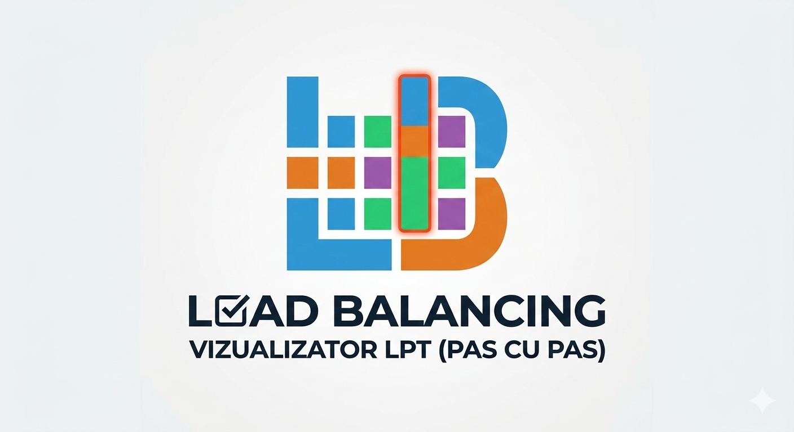

# ⚖️ Load Balancing Visualizer (Algoritmul LPT)

O aplicație web interactivă care demonstrează modul în care sarcinile (task-urile) sunt distribuite pe mai multe mașini identice pentru a minimiza timpul total de finalizare (**Makespan**). 

Proiectul vizualizează diferența dintre o abordare Greedy simplă și eursitica **LPT (Longest Processing Time)**, oferind o perspectivă clară asupra eficienței planificării.

 *

## 🚀 Caracteristici principale

* **Configurare Dinamică:** Setează numărul de mașini (între 1 și 10) și costurile sarcinilor printr-o interfață simplă.
* **Mod Pas-cu-Pas:** Observă în timp real cum fiecare task este alocat mașinii cu cea mai mică încărcare curentă.
* **Comutator LPT (Sortare):** Activează sau dezactivează sortarea descrescătoare pentru a vedea cum ordinea sarcinilor influențează rezultatul final.
* **Analiză de Performanță:** Pop-up final care calculează **Makespan-ul** și îl compară cu media ideală (Lower Bound).
* **Diagramă Gantt Interactivă:** Randare fluidă folosind HTML5 Canvas, cu culori distincte pentru fiecare sarcină.

## 🧠 Algoritmul LPT (Longest Processing Time)

Problema echilibrării sarcinilor pe mașini identice este NP-hard. Algoritmul LPT este o metodă de aproximare care:
1.  **Sortează** toate sarcinile în ordine descrescătoare a duratei.
2.  **Alocă** fiecare sarcină, pe rând, mașinii care are în acel moment cea mai mică sumă a timpilor de procesare.

**Garanție matematică:** Soluția oferită de LPT nu va depăși niciodată $4/3$ (aprox. 1.33x) din timpul optim de finalizare.

## 🛠️ Instalare și Utilizare

1.  Descarcă fișierul `load_balance.html`.
2.  Deschide-l în orice browser modern (Chrome, Firefox, Edge, Safari).
3.  Introdu numărul de mașini și lista de costuri separate prin virgulă (ex: `20, 15, 10, 5`).
4.  Apasă **"Inițializează"** și apoi parcurge pașii sau apasă **"Finalizare"**.

